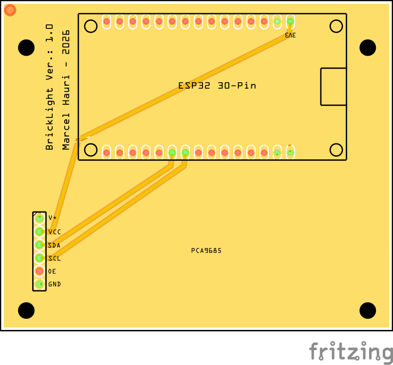

# BrickLight

An ESP32-based LED controller for lighting LEGO builds, powered by [ESPHome](https://esphome.io/) and [Home Assistant](https://www.home-assistant.io/). BrickLight drives 16 independent LED channels via a PCA9685 PWM driver, giving you smooth brightness control for each light in your creation.

## PCB



The custom PCB hosts an ESP32 30-Pin development board and a PCA9685 16-channel PWM driver, connected over I2C (GPIO32/SDA, GPIO33/SCL at 400kHz).

The full board design is available as a [Fritzing project file](assets/LegoPWM.fzz).

## Features

- 16 independently controllable monochromatic LED channels
- Smooth brightness transitions (500ms default) with gamma correction (2.8)
- Native Home Assistant integration via the ESPHome API
- OTA (Over-The-Air) firmware updates after initial flash
- WiFi fallback hotspot with captive portal for easy setup

## Hardware

| Component | Details |
|---|---|
| MCU | ESP32 DevKit (30-pin) |
| LED Driver | PCA9685 16-channel, 12-bit PWM (I2C address `0x40`) |
| I2C Bus | SDA: GPIO32, SCL: GPIO33, 400kHz |
| PWM Frequency | 1000 Hz |
| Power | 3.3V for logic, external supply for LEDs |

## Prerequisites

- [Python 3](https://www.python.org/) (3.9 or newer recommended)
- [ESPHome](https://esphome.io/guides/installing_esphome.html)
- A USB cable (micro-USB or USB-C depending on your ESP32 board) for the initial flash
- A working WiFi network

### Install ESPHome

```bash
pip install esphome
```

## Getting Started

### 1. Clone the Repository

```bash
git clone https://github.com/mhauri/BrickLight.git
cd BrickLight
```

### 2. Configure Secrets

Copy the example secrets file and fill in your values:

```bash
cp secrets.yaml.example secrets.yaml
```

Edit `secrets.yaml` with your details:

```yaml
wifi_ssid: "YourWiFiNetwork"
wifi_password: "YourWiFiPassword"
fallback_password: "FallbackHotspotPassword"
device_01_id: "01"
device_01_api_key: "your-home-assistant-api-encryption-key"
ota_password: "your-ota-password"
```

You can generate an API encryption key with:

```bash
python3 -c "import secrets, base64; print(base64.b64encode(secrets.token_bytes(32)).decode())"
```

### 3. Validate the Configuration

```bash
esphome config bricklight.yaml
```

## Flashing the ESP32

### First Flash (USB)

The initial flash must be done over USB since the device doesn't have the firmware yet.

1. Connect the ESP32 to your computer via USB.

2. Compile and upload the firmware:

   ```bash
   esphome run bricklight.yaml
   ```

3. ESPHome will auto-detect the serial port. If multiple devices are connected, you will be prompted to select the correct one. You can also specify the port explicitly:

   ```bash
   esphome run bricklight.yaml --device /dev/ttyUSB0
   ```

   Common serial port paths:
   - **Linux**: `/dev/ttyUSB0` or `/dev/ttyACM0`
   - **macOS**: `/dev/cu.usbserial-*` or `/dev/cu.SLAB_USBtoUART`
   - **Windows**: `COM3`, `COM4`, etc.

4. If the ESP32 is not detected, you may need to install the USB-to-serial driver for your board:
   - **CP2102**: [Silicon Labs CP210x driver](https://www.silabs.com/developers/usb-to-uart-bridge-vcp-drivers)
   - **CH340**: [CH340 driver](http://www.wch-ic.com/downloads/CH341SER_ZIP.html)

5. Some ESP32 boards require you to hold the **BOOT** button while pressing **EN/RST** to enter flash mode. If the upload fails, try this sequence:
   - Hold the **BOOT** button
   - Press and release the **EN/RST** button
   - Release the **BOOT** button
   - Start the upload

### Subsequent Flashes (OTA)

Once the firmware is running and the ESP32 is connected to your WiFi, you can flash over the air:

```bash
esphome run bricklight.yaml
```

ESPHome will detect the device on your network and offer OTA as an upload option. You can also target the device directly by hostname or IP:

```bash
esphome run bricklight.yaml --device brick-light-01.local
```

### Other Useful Commands

```bash
# Compile without uploading
esphome compile bricklight.yaml

# View live logs
esphome logs bricklight.yaml

# Validate configuration without compiling
esphome config bricklight.yaml
```

## Home Assistant Integration

Once flashed and connected to WiFi, the BrickLight device will be automatically discovered by Home Assistant if you have the ESPHome integration installed. Each of the 16 LED channels appears as a separate light entity (`LED 01` through `LED 16`) with brightness control.

## License

This project is open source. See the [LICENSE](LICENSE.md) file for details.
